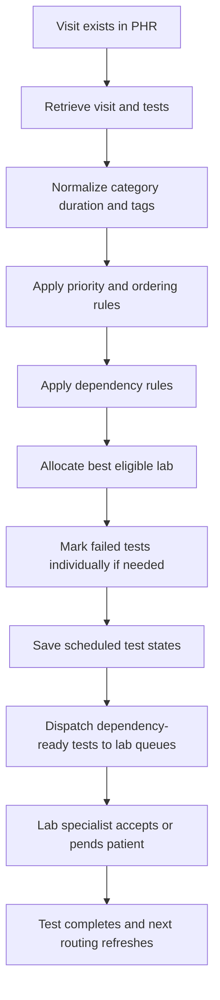
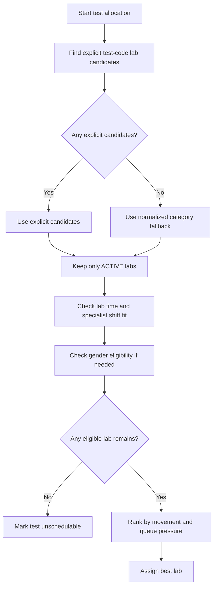
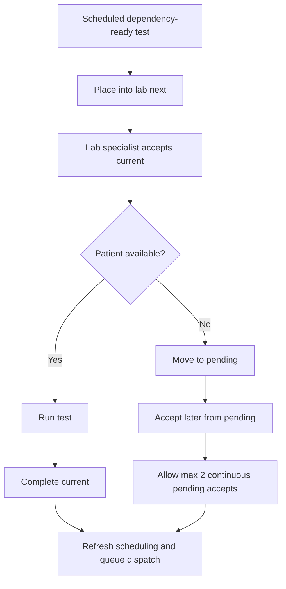

# Updated Flows And Diagrams

## 1. End-To-End Flow

```mermaid
flowchart TD
    A[Visit exists in PHR] --> B[Retrieve visit and tests]
    B --> C[Normalize category duration and tags]
    C --> D[Apply priority and ordering rules]
    D --> E[Apply dependency rules]
    E --> F[Allocate best eligible lab]
    F --> G[Mark failed tests individually if needed]
    G --> H[Save scheduled test states]
    H --> I[Dispatch dependency-ready tests to lab queues]
    I --> J[Lab specialist accepts or pends patient]
    J --> K[Test completes and next routing refreshes]
```

## 2. Allocation Flow

```mermaid
flowchart TD
    A[Start test allocation] --> B[Find explicit test-code lab candidates]
    B --> C{Any explicit candidates?}
    C -->|Yes| D[Use explicit candidates]
    C -->|No| E[Use normalized category fallback]
    D --> F[Keep only ACTIVE labs]
    E --> F
    F --> G[Check lab time and specialist shift fit]
    G --> H[Check gender eligibility if needed]
    H --> I{Any eligible lab remains?}
    I -->|No| J[Mark test unschedulable]
    I -->|Yes| K[Rank by movement and queue pressure]
    K --> L[Assign best lab]
```

## 3. Queue Flow

```mermaid
flowchart TD
    A[Scheduled dependency-ready test] --> B[Place into lab next]
    B --> C[Lab specialist accepts current]
    C --> D{Patient available?}
    D -->|Yes| E[Run test]
    D -->|No| F[Move to pending]
    E --> G[Complete current]
    F --> H[Accept later from pending]
    H --> I[Allow max 2 continuous pending accepts]
    G --> J[Refresh scheduling and queue dispatch]
    I --> J
```
