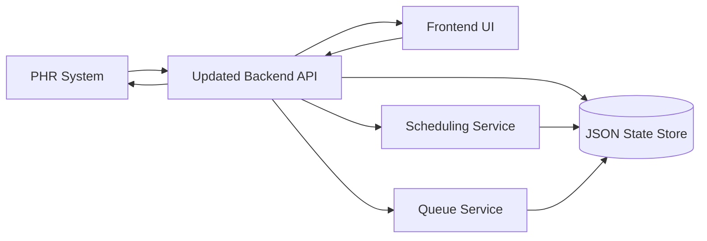
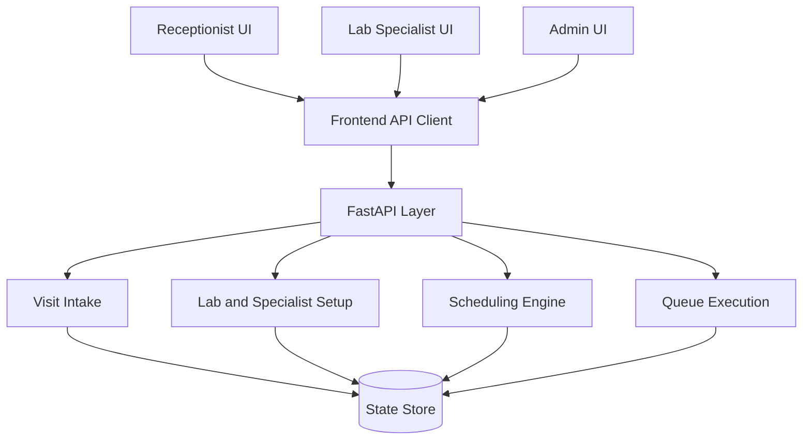
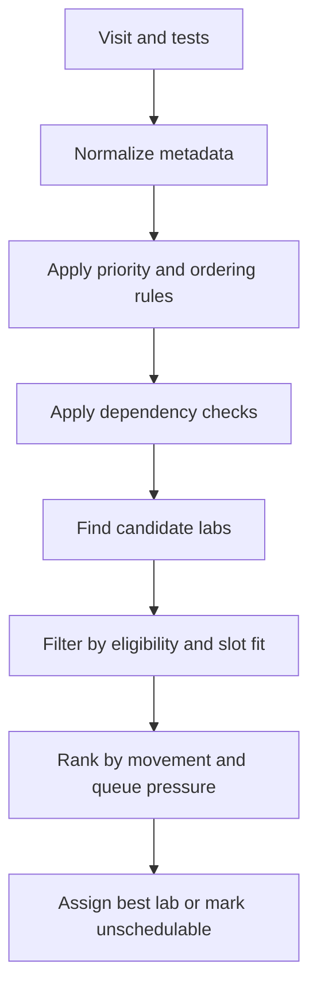

# Updated System Architecture Diagrams

## 1. High-Level Architecture

```mermaid
flowchart LR
    PHR[PHR System]
    FE[Frontend UI]
    API[Updated Backend API]
    SCH[Scheduling Service]
    QUE[Queue Service]
    STORE[(JSON State Store)]

    PHR --> API
    FE --> API
    API --> SCH
    API --> QUE
    API --> STORE
    SCH --> STORE
    QUE --> STORE
    API --> FE
    API --> PHR
```

## 2. Runtime Component View

```mermaid
flowchart TD
    A[Receptionist UI] --> B[Frontend API Client]
    C[Lab Specialist UI] --> B
    D[Admin UI] --> B
    B --> E[FastAPI Layer]
    E --> F[Visit Intake]
    E --> G[Lab and Specialist Setup]
    E --> H[Scheduling Engine]
    E --> I[Queue Execution]
    F --> J[(State Store)]
    G --> J
    H --> J
    I --> J
```

## 3. Scheduling Architecture

```mermaid
flowchart TD
    A[Visit and tests] --> B[Normalize metadata]
    B --> C[Apply priority and ordering rules]
    C --> D[Apply dependency checks]
    D --> E[Find candidate labs]
    E --> F[Filter by eligibility and slot fit]
    F --> G[Rank by movement and queue pressure]
    G --> H[Assign best lab or mark unschedulable]
```
