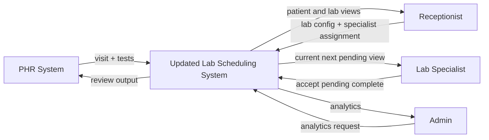
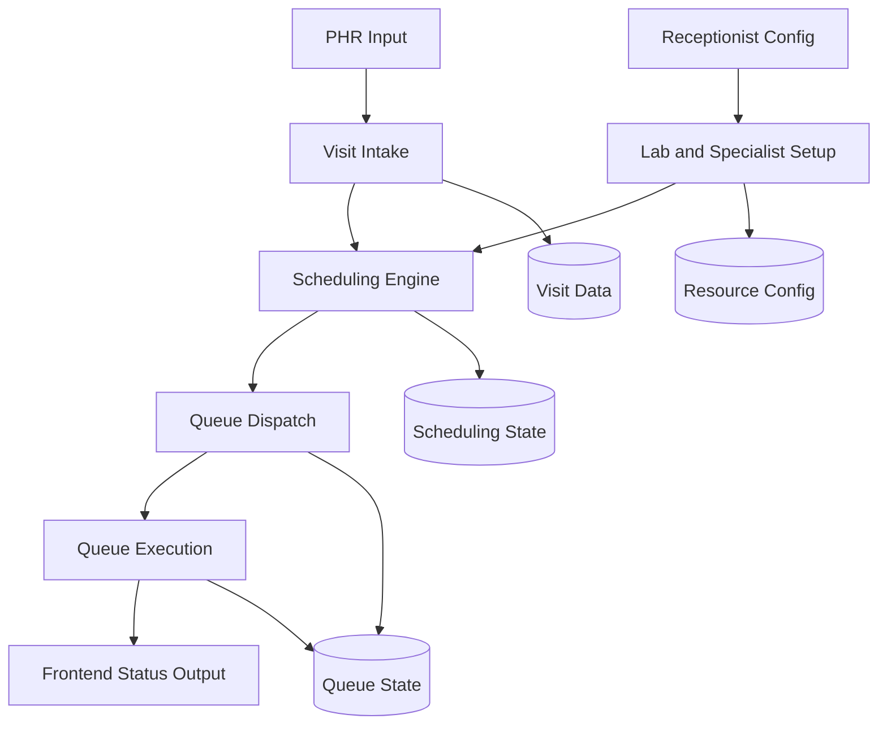
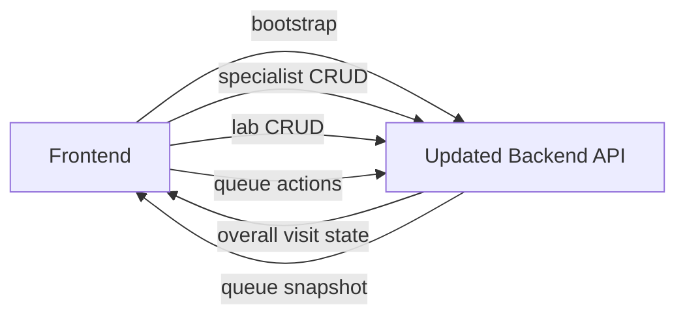

# Updated Data Flow Diagrams

## 1. Context Diagram

```mermaid
flowchart LR
    PHR[PHR System]
    R[Receptionist]
    L[Lab Specialist]
    A[Admin]
    SYS[Updated Lab Scheduling System]

    PHR -->|visit + tests| SYS
    SYS -->|review output| PHR
    R -->|lab config + specialist assignment| SYS
    SYS -->|patient and lab views| R
    L -->|accept pending complete| SYS
    SYS -->|current next pending view| L
    A -->|analytics request| SYS
    SYS -->|analytics| A
```

## 2. Level 1 Data Flow

```mermaid
flowchart TD
    A[PHR Input] --> B[Visit Intake]
    C[Receptionist Config] --> D[Lab and Specialist Setup]
    B --> E[Scheduling Engine]
    D --> E
    E --> F[Queue Dispatch]
    F --> G[Queue Execution]
    G --> H[Frontend Status Output]

    B --> S1[(Visit Data)]
    D --> S2[(Resource Config)]
    E --> S3[(Scheduling State)]
    F --> S4[(Queue State)]
    G --> S4
```

## 3. Frontend Data Flow

```mermaid
flowchart LR
    FE[Frontend] -->|bootstrap| API[Updated Backend API]
    FE -->|specialist CRUD| API
    FE -->|lab CRUD| API
    FE -->|queue actions| API
    API -->|overall visit state| FE
    API -->|queue snapshot| FE
```
