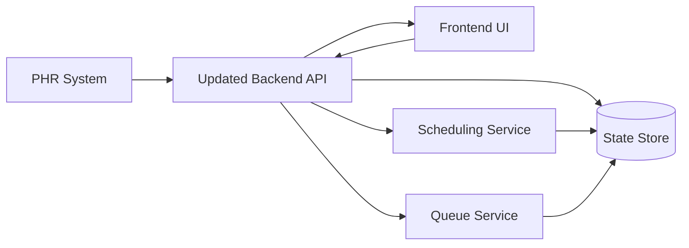
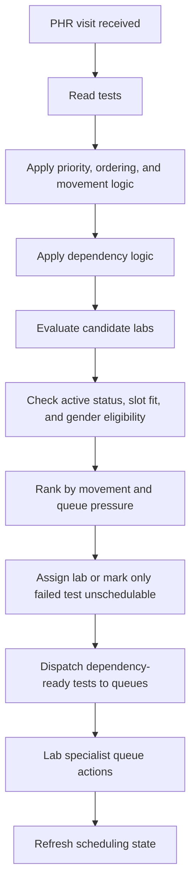
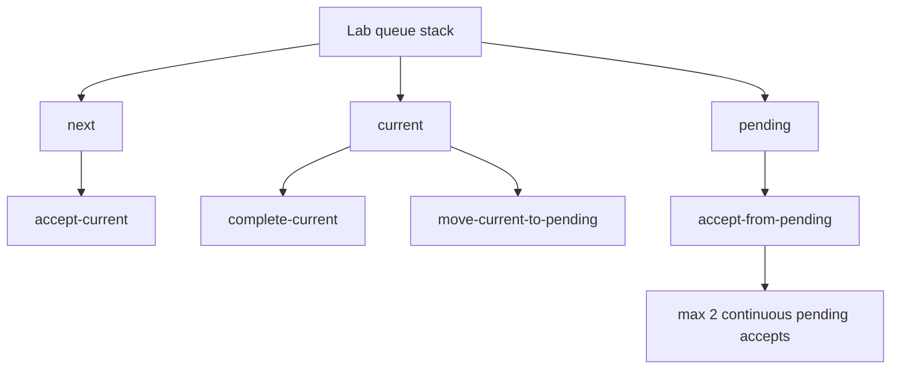
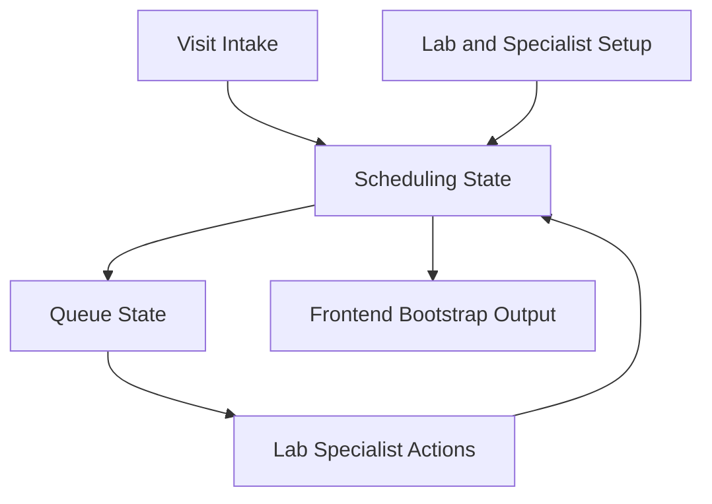

# Updated All Diagrams

## 1. High-Level Architecture

## 2. End-To-End Logic

## 3. Queue Logic

## 4. Data Flow

## 5. Current Notes

- backend keeps per-test state internally
- frontend consumes overall visit status only
- updated backend is the active backend target
- recovered seed data currently includes 8 patients
